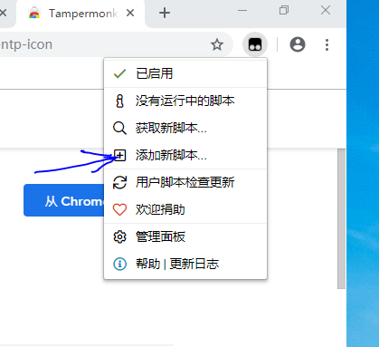
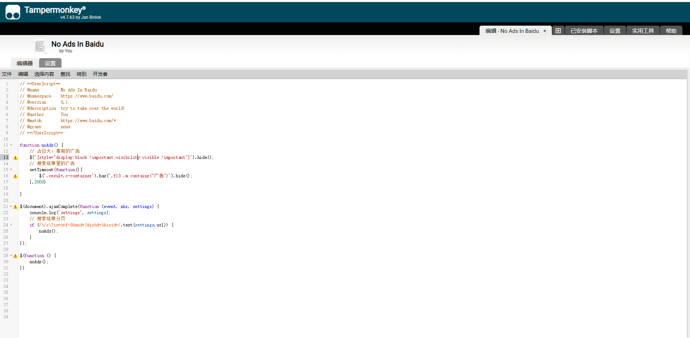
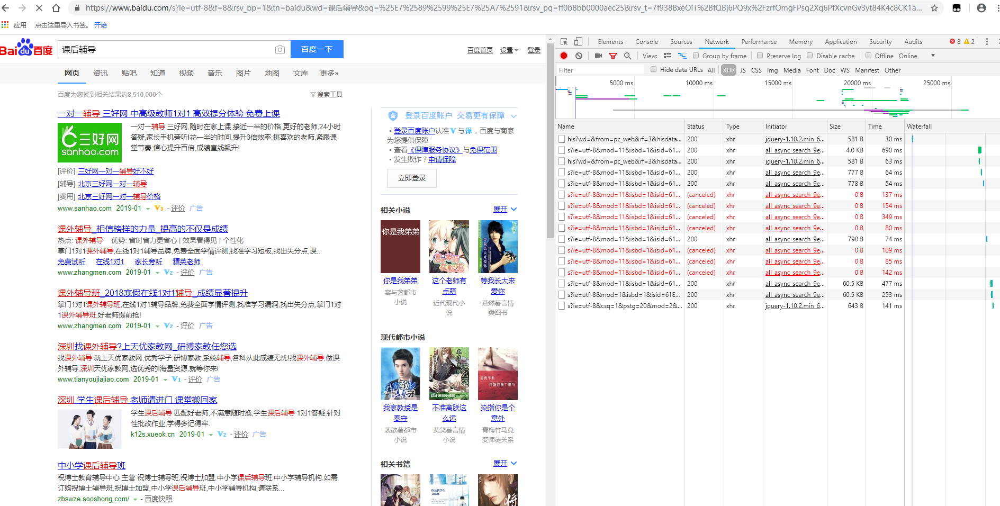
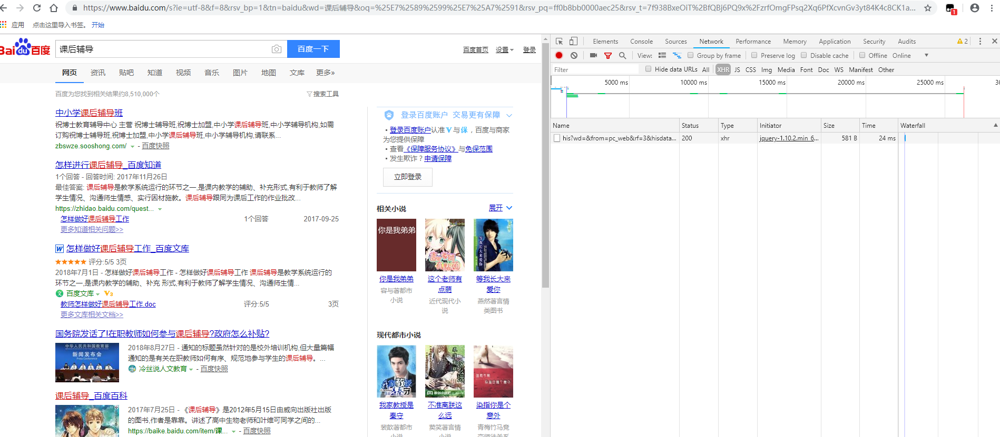

# No-Ads-in-Baidu
谷歌浏览器去掉百度搜索结果里的广告

1. 首先要在谷歌应用商用商店安装浏览器插件 tampermonkey。
[地址](https://chrome.google.com/webstore/detail/tampermonkey/dhdgffkkebhmkfjojejmpbldmpobfkfo?utm_source=chrome-ntp-icon)

2. 然后添加新脚本

3. 然后复制本项目的代码进去，ctrl+S保存

4. 进入百度看效果
没有脚本之前

运行脚本后

